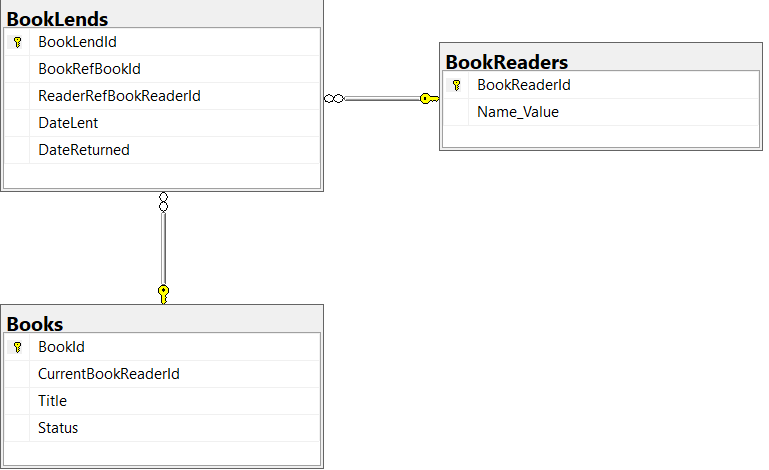
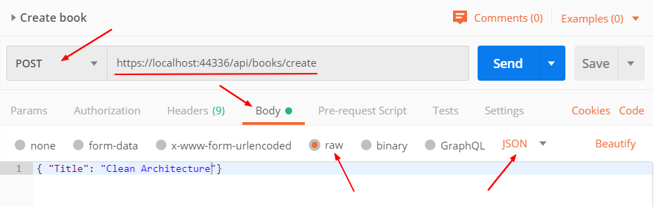

# Implementación de una Clean Architecture pequeña en CORE

Las tecnologías necesarias para ejecutar el código son las siguientes:

* Sql Server
* Visual Studio 2019
* Librerias de ASP.NET Core 3.x

## Cambiar la conexión a la base de datos
Lo primero que se debe hacer es cambiar el string de conexión en el
archivo de configuración de json:

```
"ConnectionStrings": {
    "DefaultConnection": "Server=.\\;Database=CAPatternDB;Trusted_Connection=True"
  },
```

## Crear una base de datos y migrar a la versión de la aplicación

En el adminsitrador de base de datos crear la base de datos que servirá
de repositorio.

Luego ejecutar **Update-Database** en la consola de Nuget Package Manager.

Esto le debería crear 3 tablas en la base de datos con la siguientes
estructura:



## Testear la aplicación

Para probar la aplicación se sugiere el uso de Postman para poder iniciar los
comandos y probar su desarrollo.

### Ejemplo: crear un libro

En la aplicación se puede ver que para crear un libro necesitamos el comando 
CreateBook. Este comando tiene los siguientes atributos:

```
namespace Infrastructure.Commands.V1.Books
{
    public class CreateBook
    {
        public string Title { get; set; }
    }
}
```

Por lo tanto solamente se debe colocar el título del nuevo libro en Postman 
de la siguiente manera:



Tomar en cuenta lo siguiente:

* La dirección en la cual su solución se ha publicado puede ser diferente
* Es una llamada POST
* Se pone todo el código en el Body
* En formato raw es más sencillo indicando que se envía como JSON

Luego solamente se llama a Send y al consultar la base de datos debería ver el 
nuevo registro creado.
